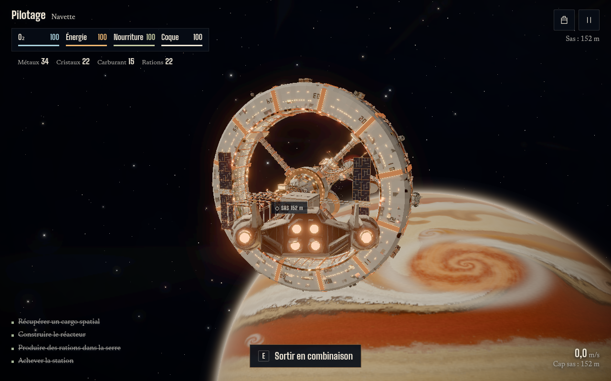
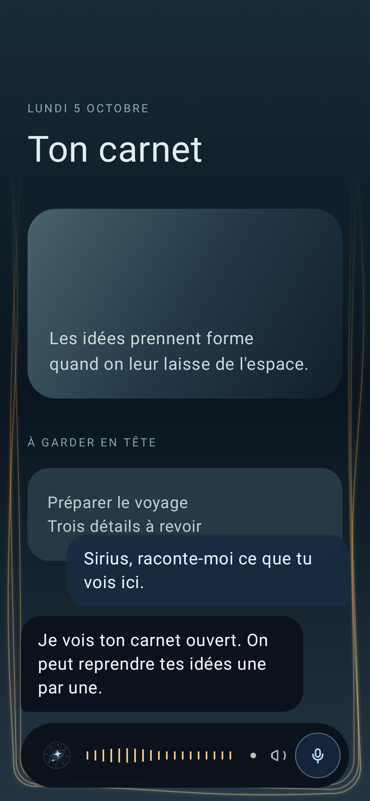

# Tom Fleischmann

Je fais des sites web et des outils sur mesure à Neuchâtel, avec mon agence [NELINK](https://www.nelink.ch).
Je travaille avec des agents IA (Claude Code, Codex) : je conçois, je découpe le travail, je relis et je teste.
Les agents écrivent une bonne partie du code, et chaque livraison passe par des tests avant d'aller en ligne.

En ce moment : des sites en 3D qui se visitent dans le navigateur, et un assistant vocal personnel.

Portfolio : [tom-fleischmann.nelink.ch](https://www.tom-fleischmann.nelink.ch)

## Projets

### Kepler-9, station orbitale
Une station imaginée autour d'une vraie planète, Kepler-9 b. On la visite au scroll, en dix haltes, du large jusqu'au lever du soleil.
three.js, Vite, GSAP, modèles construits avec Blender en ligne de commande.
[Voir le site](https://kepler-9-station.vercel.app) · [Code](https://github.com/Appash14/kepler-9)

### Kepler-9 EVA
La même station devient un jeu de survie à la troisième personne : sorties dans l'espace, navette, cargos à ramasser, station à reconstruire module par module.
Deux versions : une dans le navigateur (three.js) et un portage Unity 6 (C#) compilé sur un serveur GPU distant.

[Jouer (web)](https://kepler-9-eva.vercel.app) · [Code web](https://github.com/Appash14/kepler-9-eva) · [Jouer (Unity WebGL)](https://kepler-9-eva-unity.vercel.app)

### Sirius, assistant vocal Android
Application Android native : je parle, Sirius répond à voix haute. Mot d'éveil « Dis Sirius » détecté sur le téléphone, sans réseau en veille. Les accès au serveur restent chiffrés sur l'appareil.
Kotlin, Jetpack Compose, Vosk, captures d'écran automatiques avec Roborazzi.

[Code](https://github.com/Appash14/sirius-android)

### Cosmogonie
La naissance d'un système solaire racontée au scroll : 37 images générées par IA défilent sur un canvas.
HTML, CSS et JavaScript sans dépendance, chaîne Python pour préparer les images.

[Voir le site](https://cosmic-motion-delta.vercel.app)

### Hermes, assistant personnel auto-hébergé
Mon premier assistant IA : chat texte et vocal, en web (PWA) et en APK, sur mon propre serveur. Le modèle se change depuis l'app.
Fastify, Next.js, Docker Compose, Caddy, OpenRouter.

[Code](https://github.com/Appash14/my-hermes)

### Atelier Claude Code et Codex
Le support d'un atelier d'une journée que j'ai donné chez Digitalizers : chaque étape s'ouvre dans la salle quand je donne son code, et tout continue de marcher hors ligne.

[Code](https://github.com/Appash14/workshop-dz)

## Outils

three.js, GSAP, Vite · Unity (C#) · Kotlin, Jetpack Compose · Next.js, TypeScript · Python · Blender en ligne de commande · Vercel, GitHub Actions, Docker · Claude Code, Codex
